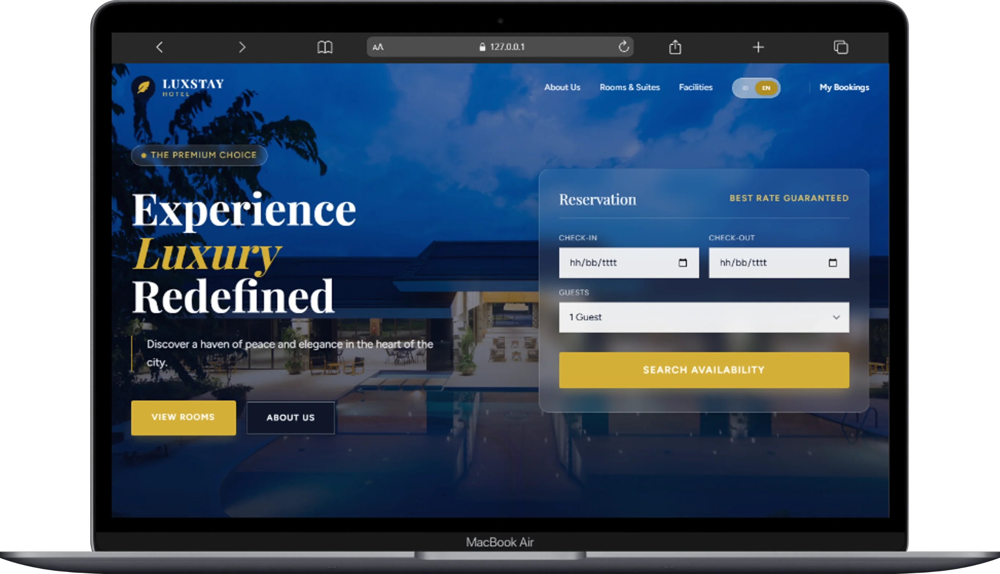
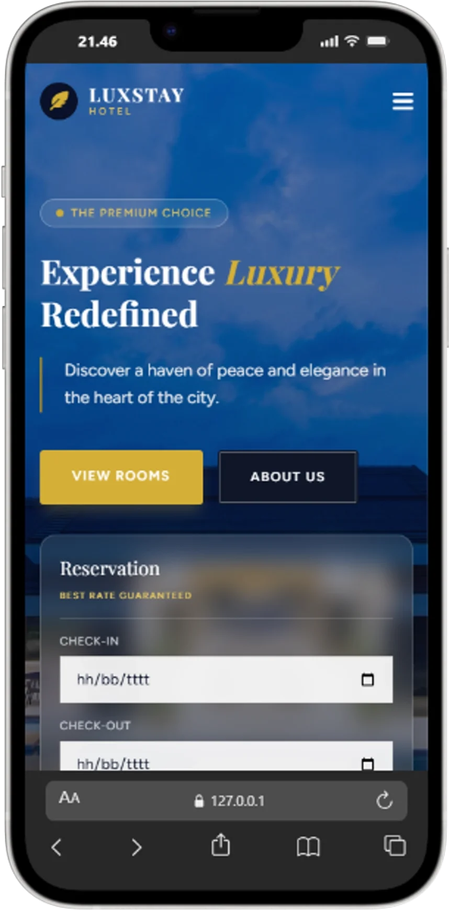
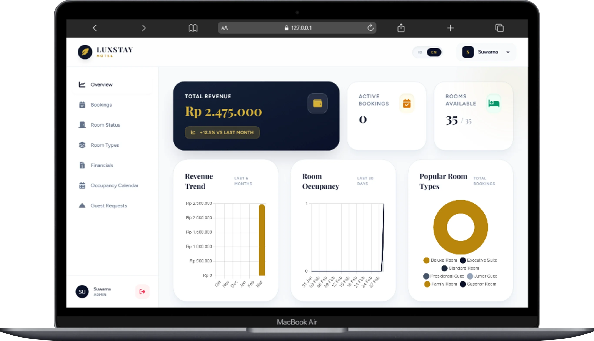
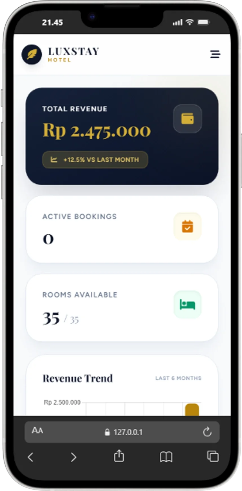
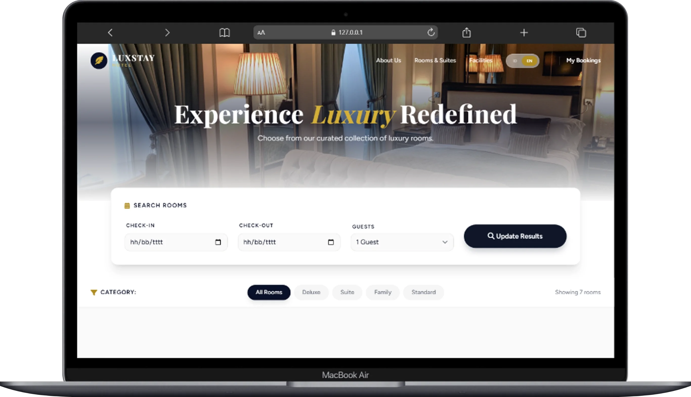
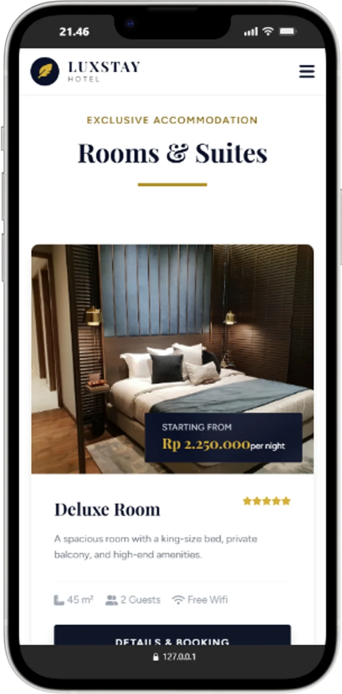
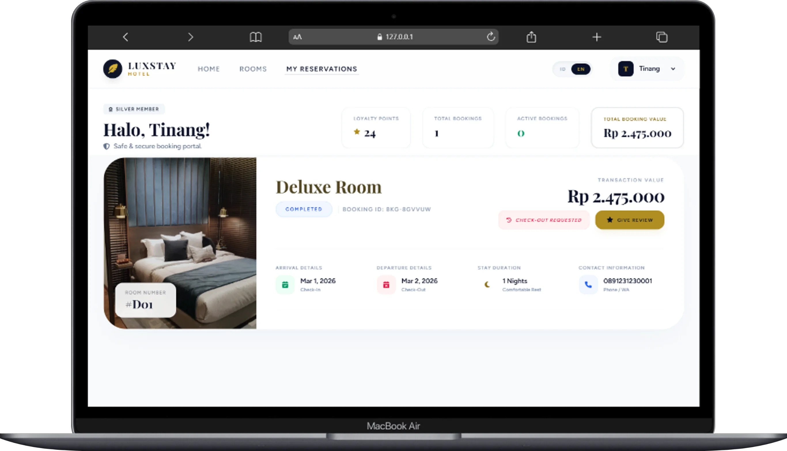
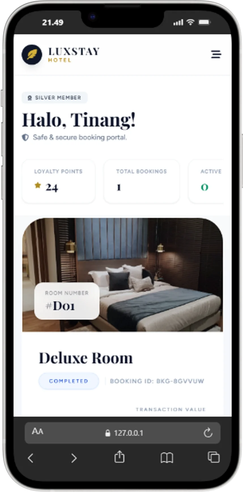

# LUXSTAY - Premium Hotel Management System

[English](#english) | [Bahasa Indonesia](#bahasa-indonesia)

---

## English

LUXSTAY is a luxury hotel management system built with a modern framework to provide a seamless, efficient, and visually stunning operational experience. This project serves as a showcase of full-stack development capabilities using **Laravel**, **Vue.js**, and **Tailwind CSS**.

### 🌐 Live Links
- **Developer Website**: [warwebsuwarna.com](http://warwebsuwarna.com)

### 📸 Screenshots

<div align="center">
  <p><b>Landing Page (Desktop & Mobile)</b></p>
  
  
  <br><br>
  
  <p><b>Admin Dashboard (Desktop & Mobile)</b></p>
  
  
  <br><br>

  <p><b>Room Management & Listing</b></p>
  
  
  <br><br>

  <p><b>User Booking System</b></p>
  
  
</div>
### ✨ Key Features
- **Real-time Dashboard**: Real-time visualization of hotel statistics (revenue, occupancy, trends).
- **Room & Room Type Management**: Room inventory management with category support and photo galleries.
- **Integrated Reservation System**: End-to-end booking flow from guest reservation to admin management.
- **Occupancy Calendar (PMS)**: Daily room availability visualization for streamlined operational planning.
- **Financial Reports**: Automatic and manual tracking of income and expense transactions.
- **Special Guest Requests**: Notification system for rapid handling of specific guest needs.
- **Premium & Responsive Design**: Elegant UI using navy and gold color palettes, optimized for all devices.
- **Admin Management**: Dedicated Artisan command to manage administrators without direct database access.

### 🛠️ Tech Stack
- **Backend**: [Laravel 12](https://laravel.com/) (PHP 8.2+)
- **Frontend**: [Vue.js 3](https://vuejs.org/) with Composition API / Options API
- **Bridge**: [Inertia.js](https://inertiajs.com/)
- **Styling**: [Tailwind CSS](https://tailwindcss.com/)
- **Database**: MySQL / MariaDB
- **Data Visualization**: [Chart.js](https://www.chartjs.org/)
- **Real-time**: Laravel Reverb / WebSockets

### 🚀 Installation
1. **Clone the repository**:
   ```bash
   git clone https://github.com/sitinang/luxstay-hotel-management.git
   cd luxstay-hotel-management
   ```
2. **Install Backend dependencies**:
   ```bash
   composer install
   ```
3. **Install Frontend dependencies**:
   ```bash
   npm install
   ```
4. **Environment Configuration**:
   ```bash
   cp .env.example .env
   php artisan key:generate
   ```
5. **Database Migration & Seeding**:
   ```bash
   php artisan migrate --seed
   ```
6. **Run Application**:
   ```bash
   # Terminal 1: Laravel Server
   php artisan serve
   # Terminal 2: Vite Dev Server
   npm run dev
   ```

---

## Bahasa Indonesia

LuxStay adalah sistem manajemen hotel mewah yang dibangun dengan framework modern untuk memberikan pengalaman pengelolaan operasional yang lancar, efisien, dan visual yang memukau. Proyek ini dirancang sebagai demonstrasi kemampuan pengembangan full-stack menggunakan **Laravel**, **Vue.js**, dan **Tailwind CSS**.

### ✨ Fitur Utama
- **Dashboard Real-time**: Visualisasi data statistik hotel (pendapatan, hunian, tren) secara real-time.
- **Manajemen Kamar & Tipe Kamar**: Pengelolaan inventaris kamar hotel dengan dukungan kategori dan galeri foto.
- **Sistem Reservasi Terintegrasi**: Alur pemesanan dari sisi tamu hingga pengelolaan di sisi admin.
- **Kalender Hunian (PMS)**: Visualisasi ketersediaan kamar harian untuk mempermudah perencanaan operasional.
- **Laporan Keuangan**: Pencatatan transaksi pendapatan dan pengeluaran secara otomatis dan manual.
- **Permintaan Khusus Tamu**: Sistem notifikasi untuk menangani permintaan khusus tamu secara cepat.
- **Desain Premium & Responsif**: Antarmuka pengguna yang elegan, menggunakan palet warna navy dan emas, dioptimalkan untuk berbagai perangkat.
- **Manajemen Admin**: Perintah Artisan khusus untuk mengelola administrator tanpa akses database langsung.

### 📸 Cuplikan Layar (Screenshots)

<div align="center">
  <p><b>Halaman Utama (Desktop & Mobile)</b></p>
  
  
  <br><br>
  
  <p><b>Dashboard Admin (Desktop & Mobile)</b></p>
  
  
  <br><br>

  <p><b>Manajemen & Daftar Kamar</b></p>
  
  
  <br><br>

  <p><b>Sistem Pemesanan (Booking)</b></p>
  
  
</div>

### 🛠️ Deskripsi Refactoring
Proyek ini telah melalui proses refactoring besar-besaran untuk meningkatkan maintainability:
- **Modularisasi Komponen**: Memecah halaman `Dashboard.vue` yang besar menjadi sub-komponen tab yang reusable.
- **Abstraksi UI**: Membuat komponen UI global seperti `StatCard` dan `BookingWidget`.
- **Optimasi Performa**: Menggunakan teknik Lazy Loading dan optimasi WebSocket.

---

## 📄 License
Project is licensed under [Creative Commons Attribution-NonCommercial 4.0 International (CC BY-NC 4.0)](LICENSE).

---
© 2026 Suwarna. Licensed under CC BY-NC 4.0.
*Developed with ❤️ for Software Engineering Portfolio.*
